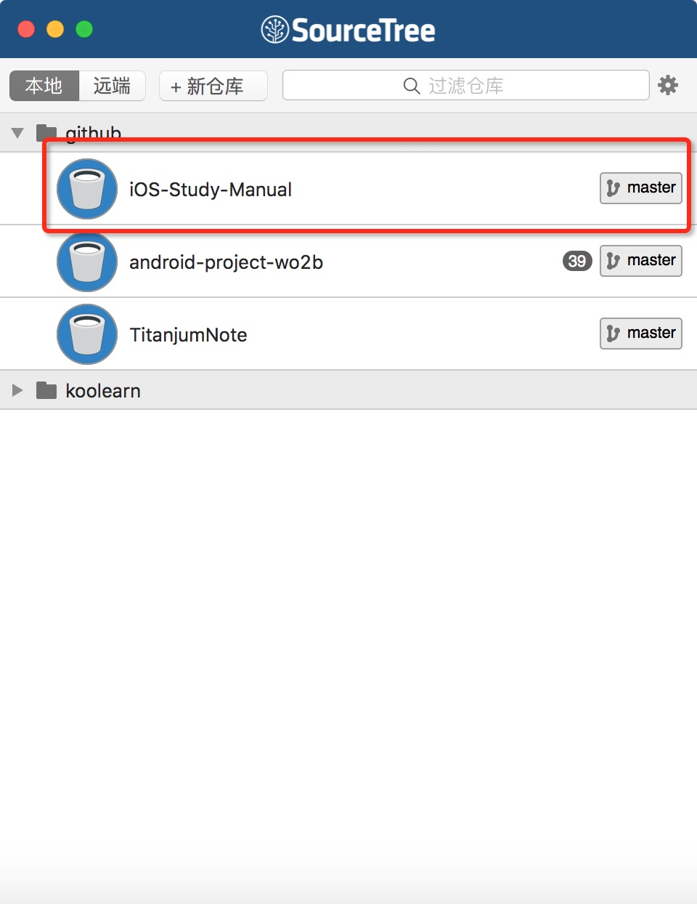
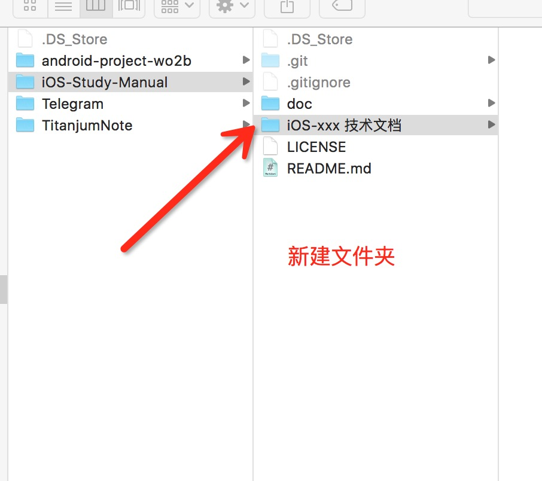
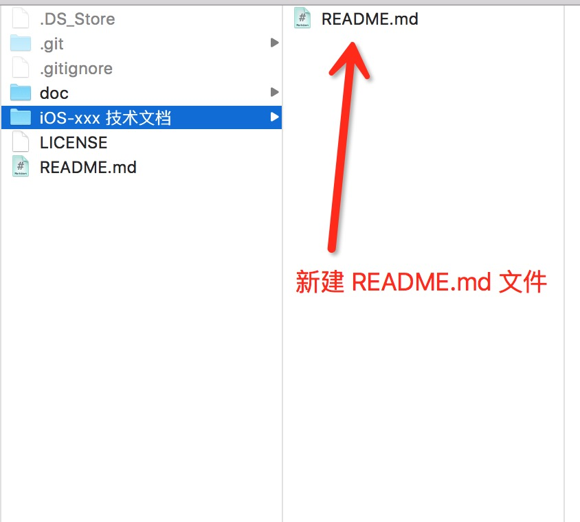

# iOS-Study-Manual
iOS study manual , help you study iOS butter

###iOS 学习手册-文档
第一步：克隆本项目

 

第二步：在项目里新建文件夹

 

第三步：新建 md 文件

 

推荐一个在线编写 markdown 的网站：https://maxiang.io/

我们可以将自己工作中所了解到的知识和技术，整理成文档，发布到这里来。

大家互相学习，有不会的地方可以再群里讨论。 QQ 群：489679110